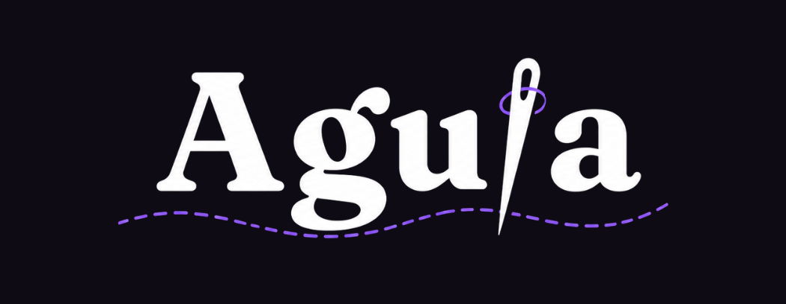

# Aguja — a debugger for the retrieval half of RAG

  

**Paste a document, run a query, and see exactly why a passage does or doesn't come back.**
Aguja shows you the chunks your RAG pipeline produces, the strategy that cut them, and the
similarity score and rank of every chunk — no top-N cut, no black box.

It answers one question: _why doesn't my retrieval find this passage?_

## Quick path

1. Paste plain text into the tool (`/tool`) — no sign-up, no API key.
2. Watch your document get split into chunks, with the boundaries drawn over the text.
3. Run a query and inspect the score and rank of every chunk.
4. Compare strategies or phrasings until the miss becomes visible.

## The problem

Retrieval-augmented systems fail quietly. A passage is right there in your document, your
search doesn't return it, and there is no obvious way to find out why. The cause is usually
invisible: the chunk boundary cut the passage in half, or the chunk is so large that the
relevant sentence is diluted, or the paragraph split produced one chunk for the whole file.

You cannot see any of that. You just get bad results.

Aguja makes the invisible part visible.

## What it does

Four tools sharing one pasted document and one loaded model for the session:

- **Chunk Inspector.** Your document with chunk boundaries drawn over it, four chunking
  strategies (fixed size, fixed size with overlap, by paragraphs, by tokenization units), and
  your query ranked against every chunk — no top-N cut.
- **Strategy Comparison.** The same document cut two different ways, side by side, so you can
  see whether a boundary is the reason a passage isn't retrieved.
- **Query Sensitivity.** The same question asked several ways, showing how much each chunk's
  rank moves — a retrieval setup that only works for one phrasing isn't working.
- **Confusable Chunks.** Pairs the retriever cannot separate, reported with both numbers and
  both chunks' own text, since similarity alone cannot tell a duplicate from a contradiction.

The interface is available in English and Spanish, each at its own address, with a language
switcher that keeps your session intact. An in-app documentation page (`/docs`) covers what RAG
is, what each tool measures with a worked example, a troubleshooting path, and the concepts
underneath — in both languages.

The analysis itself stays English-only regardless of interface language, and the interface says
so wherever a document is accepted or scores are shown — not as an afterthought, but because a
translated interface that stayed silent about that limit would be misleading by omission.

## Everything runs on your machine

Embeddings are computed in the browser. That means:

- **No API key.** Nothing to sign up for, nothing to paste in.
- **No cost.** Not for you, not for whoever is hosting it.
- **Your document never leaves your device.** No upload, no third-party service, no logging of
  what you paste.

The tradeoff is an initial model download on first use. After that it is fully local, and
switching between tools or languages does not repeat the download.

## Scope

**In:** pasting plain text, four chunking strategies, querying, ranked results with scores,
pairwise strategy comparison, query-sensitivity analysis, a near-duplicate/contradiction map
over chunks, a shareable summary image, a bilingual interface, and in-app documentation.

**Out:** file upload of any kind, semantic chunking, saved sessions, user accounts, comparing
more than two strategies at once, persistence across reloads, a multilingual _analysis_ (the
interface is bilingual; the embedding model is not), and any tool requiring generative or
second-model inference.

This is a deliberate boundary, not a backlog. See `specs/00{1,2,3}-*/spec.md` for the full
specifications and [`docs/decisions.md`](docs/decisions.md) for why the line is drawn where it
is.

## Stack

Next.js (App Router), TypeScript, Tailwind CSS, pnpm. Transformers.js running
`Xenova/all-MiniLM-L6-v2` (quantized) for in-browser embeddings. next-intl for interface
localization only — the analysis stays on one model regardless of interface language. Vitest for
unit tests (including message-catalogue parity), Playwright for end-to-end. Deployed on Vercel.

The codebase follows screaming architecture: folders under `src/features/` are named after the
problem (`chunking`, `retrieval`, `localization`, `documentation`, …), and every `domain/` folder
is free of framework imports — plain data in, plain data out. That is what makes the chunking
strategies and similarity scoring cheap to test, and what keeps localization from ever touching
the logic that decides a score.

## Documentation

| Document                                           | What it covers                                                                                     |
| -------------------------------------------------- | -------------------------------------------------------------------------------------------------- |
| [v1 spec](specs/001-rag-chunking-debugger/spec.md) | Chunking and retrieval — user stories, requirements, success criteria                              |
| [v2 spec](specs/002-rag-tool-suite/spec.md)        | The tool suite — shared session, query sensitivity, confusable chunks                              |
| [v3 spec](specs/003-bilingual-shell-docs/spec.md)  | Bilingual interface, in-app documentation, navigation shell                                        |
| [Decisions](docs/decisions.md)                     | Why it is built this way, and what was rejected                                                    |
| [Constitution](.specify/memory/constitution.md)    | Engineering principles governing the project                                                       |
| In-app docs (`/docs`)                              | What RAG is, what each tool measures, and how to troubleshoot a miss — for users, not contributors |
